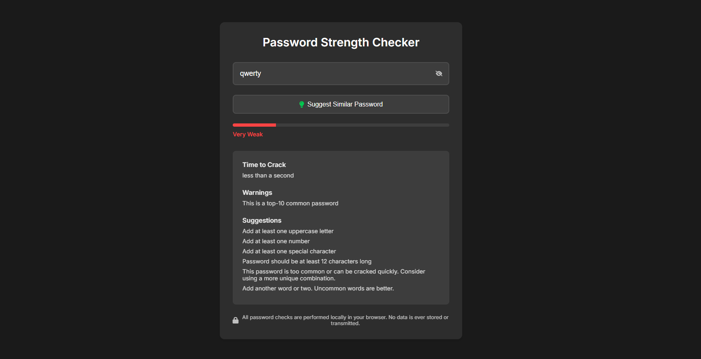

# 🔐 Password Strength Checker

A secure, modern, and user-friendly **Password Strength Checker** built using HTML, CSS, and JavaScript. It evaluates password strength in real-time and suggests improvements using Dropbox's `zxcvbn` password strength estimator.

---

## 🌟 Features

* Real-time strength meter with color-coded feedback
* Crack time estimation using zxcvbn
* Warnings and suggestions for improvement
* Visibility toggle for password input
* Suggests a stronger similar password
* All checks are performed **locally** in the browser
* Clean, responsive dark-themed UI

---

## 📸 Screenshot




---

## 📁 File Structure

```
├── index.html       # Main HTML page
├── style.css        # Styling with CSS variables and responsive design
├── script.js        # JavaScript for validation, feedback, and password suggestions
```

---

## 🚀 How to Use

1. **Clone or download** this repository.
2. Open `index.html` in any modern web browser.
3. Type a password in the input field to get strength feedback.
4. Click on the lightbulb icon to generate a stronger, similar password (if applicable).

---

## 🔐 Security Notice

> All password evaluation happens **locally in your browser**. No passwords are ever sent or stored remotely.

---

## 🧠 Author Notes

This project is built with an emphasis on both security awareness and good user experience. Ideal for demonstrating password hygiene or front-end development skills.

**Author:** [itspodleeeee](https://github.com/itspodleeeee)

---

## 📜 License

This project is open-source and free to use under the [MIT License](https://opensource.org/licenses/MIT).

---

## 🙋‍♂️ Contributions

Suggestions, feedback, and improvements are welcome! Feel free to fork the project or submit a pull request.
